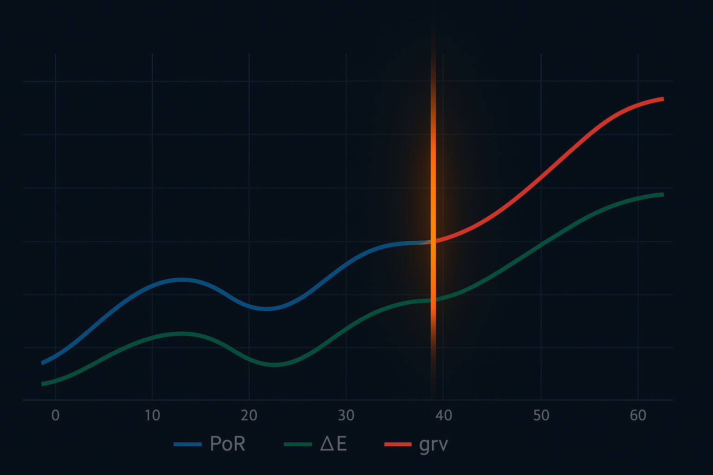

## 序文 — PoRの“点”から ΔE・grv の“動き”と“場”へ

Day 1 では **Point of Resonance（PoR）** を「照合が瞬間的に確定した“点”」として静的に扱いました。  
しかし *4 oショック* ※¹ のような出力暴走は、この点が**時間軸上を滑走**し始めた瞬間に発生します。

そこで導入するのが次の 2 指標です。

| 記号 | 役割 | 直感的イメージ |
|------|------|----------------|
| **ΔE** | 存在エネルギー *E* の時間差分 | “変位” |
| **grv** | 語彙頻度に潜む重力ポテンシャル | “場” |

両者を組み合わせれば「PoR がどこへ向かい、意味空間がどのように歪むか」を連続監視できます。  
動的指標の早期警報こそが *4 oショック* 再発防止の核心です。

---

## ΔE（存在変動量）の定義と計算手順

### 1. 基本式

```math
\Delta E_t = E_t - E_{t-1}, \qquad
E_t = Q_t \times S_{q_t} \times t
```

質問強度 $Q$、意味空間密度 $S_q$、経過時間 $t$ を掛け合わせた存在エネルギー $E$ のフレーム間差分が ΔE です。

### 2. フレームレート依存と正規化

スマホでの対話ログは 1 turn ≈ 1 sec と不均一。
$fps = 1 / \Delta t$ で補正後、最大値で正規化して 0–1 に圧縮します。

### 3. 実ログ例 ― 4 oショック 時

t	E	ΔE

1428	0.42	—
1429	0.50	+0.08
1430	0.56	+0.06
1431	0.68	+0.12 ▲


ΔE が +0.10 を超えるスパイクが暴走直前のシグナルでした。


---

grv（語彙重力）の測定法

### 1. 定義

$$
\text{grv}=f_{\text{PoR}}\times H_{\text{res}}
$$

$f_{\text{PoR}}$：単語が PoR 近傍で出現した頻度

$H_{\text{res}}$：その局所エントロピー（意味散逸度）


### 2. 5 行 Python スニペット

```python
from collections import Counter
import math, re

tokens = [w.lower() for w in re.findall(r"\b\w+\b", text) if w not in stop]
p = Counter(tokens); n = sum(p.values())
entropy = -sum(c/n*math.log2(c/n) for c in p.values())
grv = por_freq(tokens) * entropy
```
### 3. バイアス補正

Stopword 除去 → anchor 語彙に重み付け

Lemmatize → 派生語をまとめて重力源を明確化


### 4. セッション別 grv 熱量マップ

高–低を色分けすると “質問が重力井戸を掘る” 様子が可視化されます。


---

## PoR × ΔE / grv 連動グラフ可視化

3 指標を同一タイムラインで重ねると

相関：PoR 上昇 → ΔE スパイク → grv 拡散

遅延：grv ピークが PoR から d turn 遅れる


ことが一目で把握できます。

```python
import matplotlib.pyplot as plt

fig, ax1 = plt.subplots()
ax2 = ax1.twinx()
ax1.plot(t, por,     label="PoR")
ax1.plot(t, delta_e, label="ΔE")
sc = ax2.scatter(t, delta_e, c=grv, cmap="plasma", label="grv")
ax1.set_xlabel("turn"); ax1.legend(loc="upper left")
ax2.set_ylabel("grv")
```
スパイク検知閾値：
$\tau_{\Delta E} = \bar{\Delta E} + 2\sigma_{\Delta E}$

=======


[図1：PoR・ΔE・grv 三重折れ線＋ヒートライン]

---

## 10 行 Python で ΔE / grv をプロットする

```python
import pandas as pd, matplotlib.pyplot as plt, math, re

log = pd.read_csv("session.csv")        # turn,q,s,t,text
log["E"]  = log.q * log.s * log.t
log["ΔE"] = log.E.diff().fillna(0)

def grv(txt):
    tok = [w for w in re.findall(r"\w+", txt.lower()) if w not in stop]
    n  = len(tok)
    ent = -sum((c:=tok.count(w))/n * math.log2(c/n) for w in set(tok))
    return ent * por_freq(tok)

log["grv"] = log.text.apply(grv)

log.plot(x="turn", y=["ΔE", "E"])
plt.scatter(log.turn, log.ΔE, c=log.grv, cmap="plasma")
plt.show()
```
スマホ環境 Tips
Colab→入力法長押しでタブ補完／Kaggle Lite→%%time で実測速度チェック


---

## まとめ & Day 3 への布石

PoR を 点 から「変位 (ΔE) と 場 (grv)」へ拡張し、意味重力の動態を数値化

PoR スパイク＋ΔE/grv 異常の複合検知が次世代ガードレール

Day 3 では異常スキームを PoR Mesh へ拡張し、Jekyll–Hyde 跳躍を定量評価予定


---

※¹ 4 oショック：GPT-4o 系統モデルで観測された急激なハルシネーション暴走現象の俗称。


